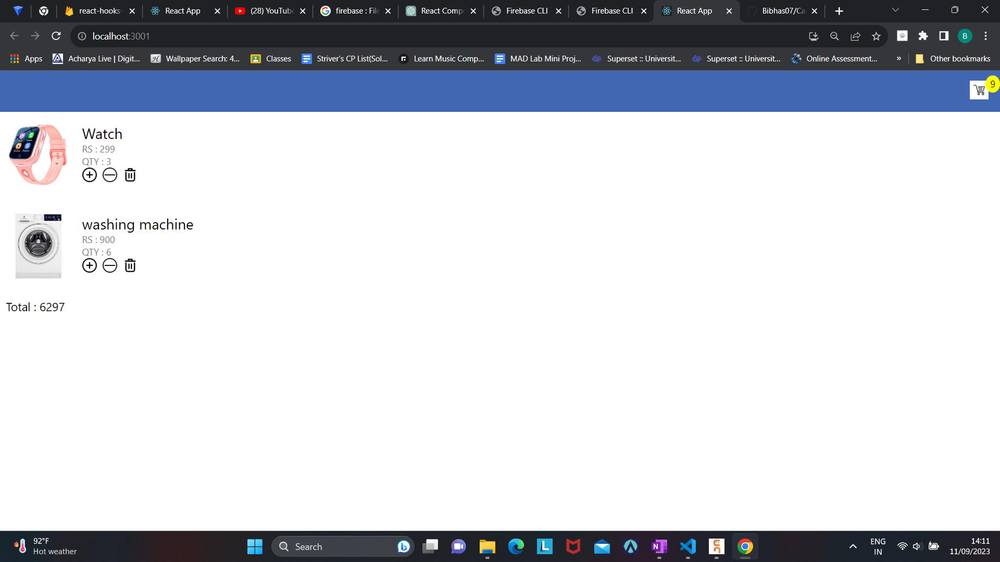

# My React Shopping Cart App

This is a simple React-based shopping cart application that allows users to view a list of products, add or remove items from the cart, and calculate the total price of items in the cart.

## Table of Contents

- [Features](#features)
- [Installation](#installation)
- [Usage](#usage)
- [Technologies Used](#technologies-used)
- [Screenshots](#screenshots)
- [Contributing](#contributing)
- [License](#license)

## Features

- View a list of products with names, prices, and quantities.
- Add items to the cart.
- Increase or decrease the quantity of items in the cart.
- Remove items from the cart.
- Calculate and display the total price of items in the cart.

## Installation

To run this project locally, follow these steps:

1. Clone the repository to your local machine:

   ```bash
   git clone https://github.com/your-username/your-react-shopping-cart.git
   ```

2. Navigate to the project folder:

   ```bash
   cd your-react-shopping-cart
   ```

3. Install project dependencies using npm or yarn:

   ```bash
   npm install
   # or
   yarn install
   ```

4. Set up Firebase:

   - Create a Firebase project on the [Firebase Console](https://console.firebase.google.com/).
   - Obtain your Firebase configuration values (API Key, Auth Domain, etc.) and update the `firebaseConfig` object in the `src/App.js` file.

   ```javascript
   const firebaseConfig = {
     apiKey: "YOUR_API_KEY",
     authDomain: "YOUR_AUTH_DOMAIN",
     // ...other config values...
   };
   ```

5. Start the development server:

   ```bash
   npm start
   # or
   yarn start
   ```

6. Open your browser and navigate to `http://localhost:3000` to view the app.

## Usage

- Browse the list of products displayed on the homepage.
- Click the "Add to Cart" button to add products to your cart.
- Use the "+" and "-" buttons to increase or decrease the quantity of items in the cart.
- Click the "Remove" button to delete items from the cart.
- The total price of items in the cart is displayed at the bottom of the page.

## Technologies Used

- React
- Firebase (Firestore)
- HTML
- CSS

## Screenshots



## Contributing

Contributions are welcome! If you would like to contribute to the project, please follow our [Contribution Guidelines](CONTRIBUTING.md).

## License

This project is licensed under the [MIT License](LICENSE).
